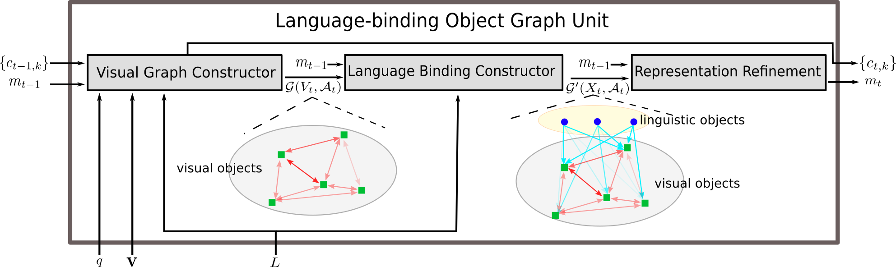

# Dynamic Language Binding in Relational Visual Reasoning

We present Language-binding Object Graph Network (LOGNet), the first neural reasoning method with dynamic relational structures across both visual and
textual domains with applications in visual question answering. LOGNet offers an effective way to automatically identify word-object affiliations and form object relations in the context of a given question.


Illustration of a LOG unit:



Check out our [paper](https://www.ijcai.org/Proceedings/2020/114) for details.

## Setups
1. Clone the repository:

    `git clone https://github.com/thaolmk54/LOGNet-VQA.git`

2. Download [CLEVR](https://cs.stanford.edu/people/jcjohns/clevr/), [CLEVR-Human](https://cs.stanford.edu/people/jcjohns/iep/) and [GQA](https://cs.stanford.edu/people/dorarad/gqa/download.html) dataset and edit corresponding paths in the repo upon where you locate your data.

3. Install dependencies:
```
conda create -n lognet_vqa python=3.6
conda activate lognet_vqa
pip install -r requirements.txt
```
## Pretrain object detection on Visual Genome
We adapt the well-known Faster RCNN [repo](https://github.com/jwyang/faster-rcnn.pytorch) implemented in PyTorch and train it on [Visual Genome](https://visualgenome.org/api/v0/api_home.html) and finally use a pretrained Faster R-CNN model for visual feature extraction. Adapted code and pretrained detection model on Visual Genome are available upon request.

## Preprocess GloVe for word embedding
Download [glove pretrained 300d word vectors](http://nlp.stanford.edu/data/glove.840B.300d.zip) to `preprocess_glove/` then unzip and process it into a pickle file:

```
python txt2pickle.py
```
Finally, save the output file `glove.840.300d.pkl` somewhere for later use.
## Experiments on CLEVR Dataset
Experiments on CLEVR are done within `exp_clevr/`. Please edit absolute paths in the configuration file at `exp_clevr/configs/clevr.yml` before running the commands.
#### Preprocessing visual features 
You can download our pre-extracted features for CLEVR dataset [here](https://deakin365-my.sharepoint.com/:f:/g/personal/lethao_deakin_edu_au/EgGRXbVvUhlAv7liZY-Q28YBYMRHPRoV2qHhcp1qwx3fvA?e=aLNHhq) and save them in `exp_clevr/data/`. 
#### Preprocess linguistic features
Extract PyTorch`.pt` files by running the following commands:
```
python preprocess/preprocess_questions.py --mode train --cfg configs/clevr.yml
    
python preprocess/preprocess_questions.py --mode val --cfg configs/clevr.yml

python preprocess/preprocess_questions.py --mode test --cfg configs/clevr.yml
```      
#### Training
Choose a suitable config file in `configs/` if you wish to train the network with full dataset, 20% of training data or 10% of the training data. For example, to train with all training samples, run the following command:
```
python train.py --cfg configs/clevr.yml
```

#### Evaluation
To evaluate the trained model, run the following:
```
python validate.py --cfg configs/clevr.yml --mode val
```
**Note**: A pretrained model on 10% of training data is available [here](https://deakin365-my.sharepoint.com/:f:/g/personal/lethao_deakin_edu_au/EgGRXbVvUhlAv7liZY-Q28YBYMRHPRoV2qHhcp1qwx3fvA?e=aLNHhq). Save the file in `results/expClevr10%LOGNet/ckpt/` for evaluation.
## Experiments on CLEVR-Human
Experiments on CLEVR-Human are done within `exp_clevr_human/`. Please edit absolute paths in the configuration file at `exp_clevr_human/configs/clevr_human.yml` before running the commands. 

Experiments on CLEVR-Human use the same visual features as CLEVR dataset.

#### Preprocess linguistic features
Extract PyTorch`.pt` files by running the following commands:
```
python preprocess/preprocess_questions.py --mode train --cfg configs/clevr_human.yml
    
python preprocess/preprocess_questions.py --mode val --cfg configs/clevr_human.yml

python preprocess/preprocess_questions.py --mode test --cfg configs/clevr_human.yml
```      

#### Training
```
python train.py --cfg configs/clevr_human.yml
```

#### Evaluation
To evaluate the trained model, run the following:
```
python validate.py --cfg configs/clevr_human.yml --mode val
```
## Experiments on GQA Dataset
Experiments on GQA dataset are done within `exp_gqa/`. Please edit absolute paths in the configuration file at `exp_gqa/configs/gqa.yml` before running the commands.
#### Preprocessing visual features 
Download object features and spatial features for GQA dataset [here](https://cs.stanford.edu/people/dorarad/gqa/download.html) and save them in `exp_gqa/data/`. We adapt the following [script](https://github.com/stanfordnlp/mac-network/tree/gqa) to merge h5 chunk files together:

```
python preprocess/merge.py --name objects
python preprocess/merge.py --name spatial
```

This should return two output files for each feature type: `gqa_objects.h5`/`gqa_spatial.h5` and `gqa_objects_merged_info.json`/`gqa_spatial_merged_info.json`.

#### Preprocess linguistic features
Extract PyTorch`.pt` files by running the following commands:
```
python preprocess/preprocess_questions.py --mode train --cfg configs/gqa.yml

python preprocess/preprocess_questions.py --mode val --cfg configs/gqa.yml

python preprocess/preprocess_questions.py --mode test --cfg configs/gqa.yml
```      
#### Training
Choose a suitable config file in `configs/` if you wish to train the network with full dataset or 20% of training data. For example, to train with all training samples, run the following command:
```
python train.py --cfg configs/gqa.yml
```

#### Evaluation
To evaluate the trained model, run the following:
```
python validate.py --cfg configs/gqa.yml --mode val
```
## Citation
If you make use of this repository for your research, please star this repo and cite the following paper:
```
@inproceedings{ijcai2020-114,
  title     = {Dynamic Language Binding in Relational Visual Reasoning},
  author    = {Minh Le, Thao and Le, Vuong and Venkatesh, Svetha and Tran, Truyen},
  booktitle = {Proceedings of the Twenty-Ninth International Joint Conference on
               Artificial Intelligence, {IJCAI-20}},
  publisher = {International Joint Conferences on Artificial Intelligence Organization},             
  editor    = {Christian Bessiere}	
  pages     = {818--824},
  year      = {2020},
  month     = {7},
  note      = {Main track}
  doi       = {10.24963/ijcai.2020/114},
  url       = {https://doi.org/10.24963/ijcai.2020/114},
}
```
## Acknowledgement
- We thank @jwyang for releasing the PyTorch code for object detection and the pretrained models. 
- We refer to this [repo](https://github.com/facebookresearch/clevr-iep) for preprocessing.
- Our implementation of dataloader is based on this [repo](https://github.com/shijx12/XNM-Net).